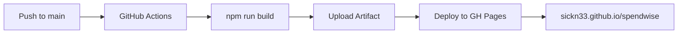

# 🗺️ SpendWise Project Mapping

> Mappatura completa del progetto generata il 18 Gennaio 2026

---

## 📋 Overview

| Proprietà      | Valore                                                    |
| -------------- | --------------------------------------------------------- |
| **Nome**       | SpendWise                                                 |
| **Tipo**       | Personal Expense Tracker PWA                              |
| **Framework**  | React 19 + TypeScript                                     |
| **Build Tool** | Vite 7                                                    |
| **Deployment** | GitHub Pages                                              |
| **Repository** | [sickn33/spendwise](https://github.com/sickn33/spendwise) |

---

## 🛠️ Tech Stack

```mermaid
graph TB
    subgraph Frontend
        React[React 19]
        TS[TypeScript 5.9]
        RR[React Router 7]
    end

    subgraph Build
        Vite[Vite 7]
        PWA[vite-plugin-pwa]
        ESLint
    end

    subgraph Storage
        Dexie[Dexie.js]
        IDB[(IndexedDB)]
    end

    subgraph Libraries
        ChartJS[Chart.js]
        Lucide[Lucide Icons]
        DateFns[date-fns]
        jsPDF
        xlsx
    end

    React --> Dexie --> IDB
    Vite --> PWA
</mermaid>
```

---

## 📁 Struttura del Progetto

```
spendwise/
├── .github/workflows/
│   └── deploy.yml          # CI/CD GitHub Pages
├── public/
│   ├── icon-192.png
│   └── icon-512.png
├── src/
│   ├── components/         # 9 componenti React
│   ├── services/           # 3 servizi business logic
│   ├── db/                 # Database layer (Dexie)
│   ├── types/              # TypeScript definitions
│   ├── App.tsx             # Router & Layout principale
│   ├── main.tsx            # Entry point
│   └── index.css           # Design system (~24KB)
├── vite.config.ts          # Config Vite + PWA
└── package.json
```

---

## 🧩 Componenti

| Componente          | File                                                                                                           | Size | Descrizione                            |
| ------------------- | -------------------------------------------------------------------------------------------------------------- | ---- | -------------------------------------- |
| **TransactionList** | [TransactionList.tsx](file:///Users/nicco/Antigravity%20Projects/spendwise/src/components/TransactionList.tsx) | 25KB | Lista transazioni con filtri e ricerca |
| **CategoryManager** | [CategoryManager.tsx](file:///Users/nicco/Antigravity%20Projects/spendwise/src/components/CategoryManager.tsx) | 22KB | Gestione categorie spese               |
| **SavingsGoals**    | [SavingsGoals.tsx](file:///Users/nicco/Antigravity%20Projects/spendwise/src/components/SavingsGoals.tsx)       | 20KB | Obiettivi di risparmio                 |
| **Dashboard**       | [Dashboard.tsx](file:///Users/nicco/Antigravity%20Projects/spendwise/src/components/Dashboard.tsx)             | 18KB | Dashboard con charts                   |
| **Reports**         | [Reports.tsx](file:///Users/nicco/Antigravity%20Projects/spendwise/src/components/Reports.tsx)                 | 16KB | Report e analytics                     |
| **TransactionForm** | [TransactionForm.tsx](file:///Users/nicco/Antigravity%20Projects/spendwise/src/components/TransactionForm.tsx) | 14KB | Form nuova transazione                 |
| **BudgetManager**   | [BudgetManager.tsx](file:///Users/nicco/Antigravity%20Projects/spendwise/src/components/BudgetManager.tsx)     | 13KB | Gestione budget                        |
| **Settings**        | [Settings.tsx](file:///Users/nicco/Antigravity%20Projects/spendwise/src/components/Settings.tsx)               | 13KB | Impostazioni app                       |
| **QuickAddWidget**  | [QuickAddWidget.tsx](file:///Users/nicco/Antigravity%20Projects/spendwise/src/components/QuickAddWidget.tsx)   | 11KB | Widget quick-add                       |

---

## ⚙️ Servizi

| Servizio       | File                                                                                             | Descrizione                   |
| -------------- | ------------------------------------------------------------------------------------------------ | ----------------------------- |
| **Analytics**  | [analytics.ts](file:///Users/nicco/Antigravity%20Projects/spendwise/src/services/analytics.ts)   | Calcoli statistiche e trends  |
| **Importer**   | [importer.ts](file:///Users/nicco/Antigravity%20Projects/spendwise/src/services/importer.ts)     | Import/Export CSV, Excel, PDF |
| **Classifier** | [classifier.ts](file:///Users/nicco/Antigravity%20Projects/spendwise/src/services/classifier.ts) | ML categorization transazioni |

---

## 🗄️ Database

- **Engine**: IndexedDB via [Dexie.js](https://dexie.org/)
- **Config**: [database.ts](file:///Users/nicco/Antigravity%20Projects/spendwise/src/db/database.ts)
- **Storage**: 100% locale (nessun server)

---

## 🚀 Deployment



**Workflow**: [deploy.yml](file:///Users/nicco/Antigravity%20Projects/spendwise/.github/workflows/deploy.yml)

---

## 📦 Dipendenze Principali

| Dipendenza       | Versione | Uso               |
| ---------------- | -------- | ----------------- |
| react            | 19.2.0   | UI Framework      |
| react-router-dom | 7.11.0   | Routing           |
| dexie            | 4.2.1    | IndexedDB wrapper |
| chart.js         | 4.5.1    | Grafici           |
| lucide-react     | 0.562.0  | Icone             |
| jspdf            | 4.0.0    | Export PDF        |
| xlsx             | 0.18.5   | Export Excel      |
| date-fns         | 4.1.0    | Date utilities    |

---

## 🔧 Scripts NPM

```bash
npm run dev      # Dev server (localhost:5173)
npm run build    # Build produzione
npm run preview  # Preview build
npm run lint     # ESLint check
```

---

## ✅ Features Chiave

- ✅ PWA installabile
- ✅ Offline-first (Service Worker)
- ✅ ML categorization automatica
- ✅ Import/Export (CSV, Excel, PDF)
- ✅ Charts interattivi
- ✅ Privacy-focused (dati locali)
- ✅ Deploy automatico su GitHub Pages
